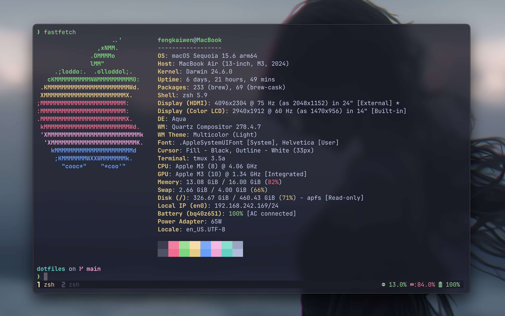

# kelf's dotfiles



## 什么是dotfile?

在 Unix/Linux/macOS 的世界里，dotfile（点文件）是指以 . 开头的隐藏配置文件。它们通常用来保存用户的 个性化设置、环境变量、程序配置等。有了这些配置文件，就可以在各个机器上一键构建开发环境。


## 仓库简介

目前我的主力是一台MacBook air，日常中使用ssh连接到实验室的服务器上进行开发。

主要使用到的工具：

- Neovim，速度快，ssh到远程终端的时候可以快速打开项目，使用Lazy.vim来进行插件的管理
- Ghostty: 终端模拟器，渲染速度快
- Tmux：在服务器上实现持久化
- Rime，开源的输入法，自定义程度很高，例如实现ESC切换到英文
- Raycast: 查找文件，快速启动应用
- Aerospace: 平铺式窗口管理器，设置虚拟空间，快速切换窗口

好用的CLI工具:

- lazygit：git工具
- fzf：模糊查找一切，包括但不限于：文件、历史记录、命令
- zoxid：替代cd命令，可以直接跳转到之前去过的任何目录
- bat：带有高亮功能的cat命令
- tldr：简洁版的man命令
- rg: 速度更快的grep，并且带有高亮显示
- fd: 优化版本的find，更快有高亮
- yazi: 文件管理器
- tokei: 代码统计工具


## 使用

### setup.sh

这个脚本用来一键安装常用的软件

```
bash ./setup.sh
```

### GNU stow

stow 用于在系统对应位置创建指向此dotfile的软链接

例如：

```
❯ ll .zshrc .tmux.conf
lrwxr-xr-x@ - kelf 16 Aug 23:17 .tmux.conf -> dotfiles/.tmux.conf
lrwxr-xr-x@ - kelf 16 Aug 23:17 .zshrc -> dotfiles/.zshrc
```

(1) 配置软链接

```shell
stow .
```

(2) 取消软链接

```shell
stow -D .
```


### rime 输入法

对于Rime输入法的配置，单独使用:

```
bash ./setup_rime.sh
```
 

### Tmux

进入tmux之后还需要使用 `<C-a>+I` 安装插件
