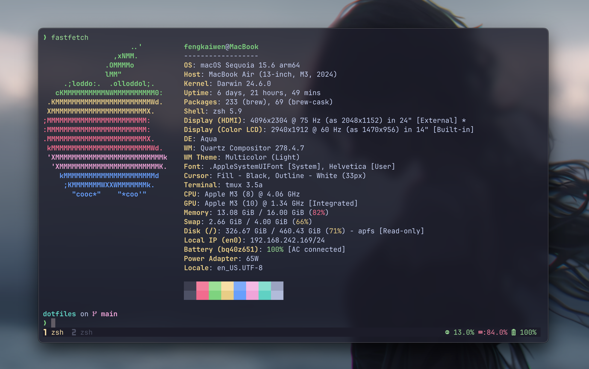

# kelf's dotfiles

<p align="center">
  
</p>

<p align="center">
  <a href="#"> macOS / Linux </a>
  <span> · </span>
  <a href="#"> Neovim </a>
  <span> · </span>
  <a href="#"> Tmux </a>
  <span> · </span>
  <a href="#"> Ghostty </a>
</p>

## 什么是 dotfile？

在 Unix / Linux / macOS 的世界里，**dotfile** 指以 `.` 开头的隐藏配置文件。它们保存了用户的个性化设置、环境变量、程序配置等信息。借助 dotfile，可以在新机器上一键复刻完整的开发环境。

---

## 📖 目录

- [🖥️ 开发环境](#️-开发环境)
- [🛠️ 核心工具栈](#️-核心工具栈)
  - [编辑器](#编辑器)
  - [终端与复用器](#终端与复用器)
  - [窗口管理与效率工具](#窗口管理与效率工具)
  - [按键映射](#按键映射)
- [📦 CLI 工具箱](#-cli-工具箱)
- [🚀 快速开始](#-快速开始)
  - [一键安装](#一键安装)
  - [setup.sh 原理](#setupsh-原理)
  - [使用 GNU Stow 管理软链接](#使用-gnu-stow-管理软链接)
  - [Rime 输入法配置](#rime-输入法配置)
  - [Tmux 插件安装](#tmux-插件安装)

---

## 🖥️ 开发环境

目前主力机器是一台 **MacBook Air**，日常通过 SSH 连接实验室服务器进行远程开发。

## 🛠️ 核心工具栈

### 编辑器

- **[Neovim](https://neovim.io/)** — 极速启动，SSH 场景下秒开项目；使用 **VimPack** 进行插件管理

### 终端与复用器

- **~~Kitty~~** → **[Ghostty](https://ghostty.org/)** — 新一代终端模拟器，GPU 加速渲染，速度极快
- **[Tmux](https://github.com/tmux/tmux)** — 终端复用器，在服务器上实现会话持久化

### 窗口管理与效率工具

- **[Aerospace](https://github.com/nikitabobko/AeroSpace)** — 平铺式窗口管理器，支持虚拟桌面与快速窗口切换
- **[Raycast](https://www.raycast.com/)** — 启动器与效率工具，快速查找文件、启动应用

### 输入法

- **~~Rime~~** → **微信输入法** — 搭配 **Karabiner-Elements** 实现 `ESC` 切换英文模式

### 按键映射

- **[Karabiner-Elements](https://karabiner-elements.pqrs.org/)**
  - `ESC` → 切换输入法
  - `Caps Lock` ↔ `Ctrl` 交换
  - 外接 Windows 键盘适配（`Command` ↔ `Option` 交换）

## 📦 CLI 工具箱

| 工具 | 说明 |
|------|------|
| [lazygit](https://github.com/jesseduffield/lazygit) | 终端里的 Git TUI，直观高效 |
| [fzf](https://github.com/junegunn/fzf) | 模糊查找神器：文件、历史记录、命令…… |
| [zoxide](https://github.com/ajeetdsouza/zoxide) | `cd` 的替代品，智能跳转已访问目录 |
| [bat](https://github.com/sharkdp/bat) | 带语法高亮的 `cat` |
| [tldr](https://tldr.sh/) | 简洁版 `man`，直击常用示例 |
| [ripgrep (rg)](https://github.com/BurntSushi/ripgrep) | 极速 `grep`，默认高亮 |
| [fd](https://github.com/sharkdp/fd) | 更友好的 `find`，快速且带高亮 |
| [yazi](https://github.com/sxyazi/yazi) | 终端文件管理器 |
| [tokei](https://github.com/XAMPPRocky/tokei) | 代码统计，支持多种语言 |

## 🚀 快速开始

### 一键安装

`setup.sh` 用于在新机器上一键安装常用软件（无需 root 权限，默认安装到 `~/.local`）：

```bash
bash ./script/setup.sh
```

> 需要提前安装 `cmake`。

### setup.sh 原理

这个脚本的设计目标是**无需 root 权限**，在新机器上一键构建完整的 CLI 开发环境。所有软件统一安装到 `~/.local` 目录下，避免污染系统环境。

**核心机制：**

| 机制 | 说明 |
|------|------|
| **幂等安装** | 使用 `ensure_cmd()` 和 `ensure_dir()` 辅助函数：如果命令或目录已存在则跳过，可安全反复执行 |
| **严格模式** | `set -euo pipefail`，任一命令失败即终止，避免半吊子安装 |
| **前置检查** | 自动检测 `cmake`、`curl`、`wget`、`git` 和 `libclang`，缺失时给出安装提示 |

**三层安装策略：**

1. **Rust CLI 工具** — 通过 `cargo-binstall` 从预编译二进制直接安装（免编译）
   - ripgrep、eza、fd-find、du-dust、yazi、tlrc、tokei、tree-sitter-cli、bat

2. **GitHub Release 二进制** — 通过 `eget` 自动下载最新 release
   - fzf、fastfetch、lazygit、fnm、ImageMagick

3. **系统包管理器** — 平台适配，优先使用系统原生包
   - **macOS**：`brew install`（Neovim、ImageMagick）
   - **Arch Linux**：`pacman -S`（Neovim、ImageMagick、LazyGit）
   - **其他 Linux**：fallback 到 `eget` 下载预编译包

**其他工具：**
- **TPM**（Tmux Plugin Manager）：`git clone` 到 `~/.tmux/plugins/tpm`
- **uv**（Python 包管理器）：curl 官方脚本安装
- **Python CLI**：`uv tool install kimi-cli`、`nvitop`

### 使用 GNU Stow 管理软链接

[GNU Stow](https://www.gnu.org/software/stow/) 会在系统对应位置创建指向本仓库的符号链接，方便集中管理配置。

示例效果：

```bash
❯ ls -l ~/.zshrc ~/.tmux.conf
lrwxr-xr-x  kelf  dotfiles/.tmux.conf -> dotfiles/.tmux.conf
lrwxr-xr-x  kelf  dotfiles/.zshrc -> dotfiles/.zshrc
```

**创建软链接：**

```bash
stow .
```

**取消软链接：**

```bash
stow -D .
```

> 部分文件和目录已通过 `.stow-local-ignore` 排除（如 `assets/`、`doc/`、`script/` 等），避免误链接。

### Tmux 插件安装

首次进入 Tmux 后，按 `<C-a> + I`（大写 i）自动安装插件。
